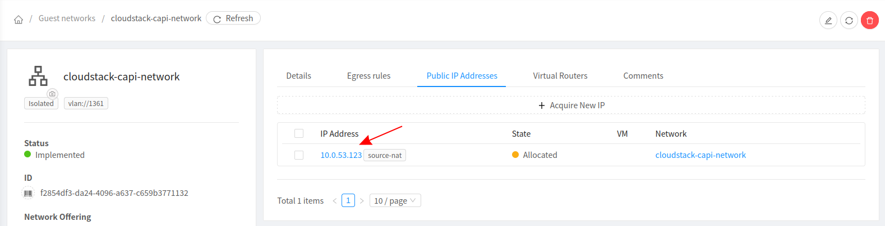
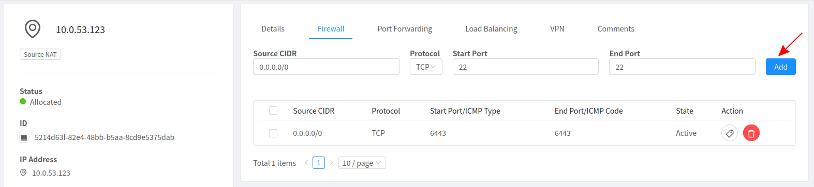
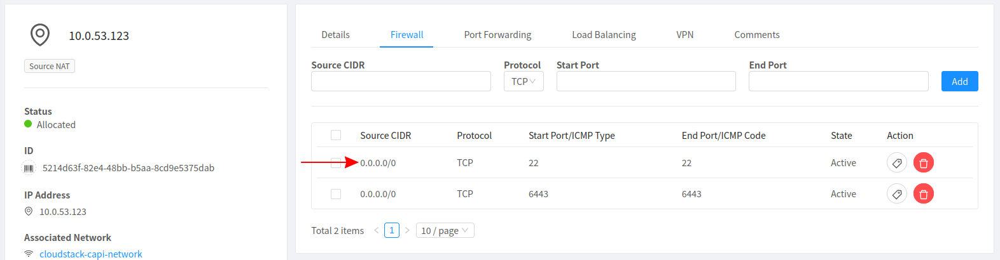
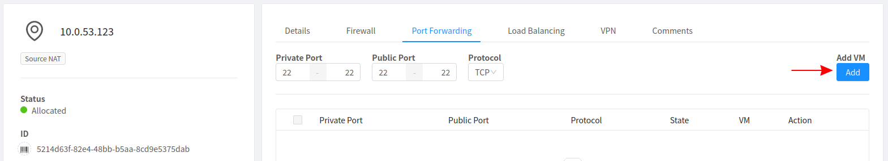
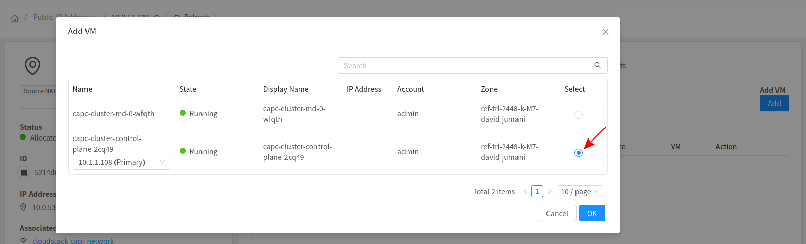
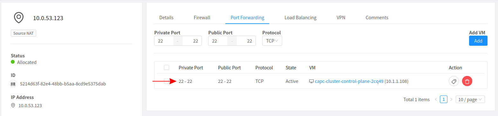

# SSH Access To Nodes

This guide will detail the steps to access the CAPC nodes.

Please note that this will only work on Isolated Networks. To access Nodes on shared networks, please configure the routes on the external network's management plane

## Prerequisites

The user must either know the password of the node or have the respective SSH private key matching the public key in the authorized_keys file in the node

To see how to pass a key pair to the node, checkout the [keypair configuration](../clustercloudstack/configuration.html#ssh-keypair)

## Configure Network Access

In order to access the nodes, the following changes need to be made in Apache CloudStack

1. Select the Public IP belonging to the network via which users can access the VM.
Either use the exiting IP or acquire a new IP.

    

2. Add a firewall rule to allow access on the desired port

    
    

3. Add a port forwarding rule with the corresponding port to the firewall rule that was just created

    

    Select the VM to which you would like SSH Access

    
    


## SSH Into The Node

Now access the node via the Public IP using the corresponding SSH Keypair. The username is `ubuntu` for ubuntu images and `cloud-user` for rockylinux8 images.

```
$ ssh ubuntu@10.0.53.123 -i path/to/key

Welcome to Ubuntu 20.04.3 LTS (GNU/Linux 5.4.0-97-generic x86_64)

 * Documentation:  https://help.ubuntu.com
 * Management:     https://landscape.canonical.com
 * Support:        https://ubuntu.com/advantage

The programs included with the Ubuntu system are free software;
the exact distribution terms for each program are described in the
individual files in /usr/share/doc/*/copyright.

Ubuntu comes with ABSOLUTELY NO WARRANTY, to the extent permitted by
applicable law.

To run a command as administrator (user "root"), use "sudo <command>".
See "man sudo_root" for details.

ubuntu@capc-cluster-control-plane-2cq49:~$

```
